# Arquitetura do Hermes Agentic Auditor & AI Ops Ledger

Este documento descreve a arquitetura geral, o fluxo de execução e os componentes do **Hermes Agentic Auditor**, um sistema autônomo, estático, local e reproduzível para auditoria de projetos de IA e agentes autônomos.

---

## 🏗️ Visão Geral da Arquitetura

O sistema foi desenhado com o princípio de **privacidade e independência**, executando todo o raciocínio de IA e análise estática **100% localmente via Ollama**, sem depender de APIs de nuvem para o processamento de código (como tokens da Gemini).

### Diagrama de Fluxo Geral (Mermaid)

```mermaid
graph TD
    %% CLI & Entrypoint
    CLI["CLI / main.py\n(Orquestração Inicial)"] --> Agent["HermesAuditor\n(agent/agent.py)"]

    %% Collection & Analysis Phase
    Agent --> Collector["GitHubCollector\n(skills/github_collector.py)"]
    Collector --> Downloader["API GitHub / Arquivo ZIP Seguro"]
    Downloader --> Analyzer["CodeAnalyzer\n(skills/code_analyzer.py)"]
    
    %% Trivy Security Scan
    Analyzer --> Trivy["TrivyScanner\n(agent/trivy.py)\n- Vulnerabilidades\n- Segredos / Credenciais\n- Guardrails de Config"]

    %% Skills & Local Ollama Execution
    Trivy --> Context["Contexto Selecionado & Enriquecido"]
    Context --> Skills["Skills Especializadas\n- FinOpsAuditor\n- ResilienceAuditor\n- SecurityAuditor\n- ObservabilityAuditor"]

    Skills --> OllamaClient["OllamaClient\n(agent/ollama_client.py)"]
    OllamaClient --> OllamaServer["Ollama Local\n(http://localhost:11434)\nModelo: hermes3:8b"]

    %% Validation & Scoring
    OllamaServer --> Validator["AuditValidator\n(agent/validator.py)\n(Validação de Schema JSON)"]
    Validator --> Scorer["DeterministicScorer\n(agent/scorer.py)\n(Pesos, Notas e Cálculo)"]

    %% Reporting & GitHub Pages
    Scorer --> Reporter["ReportGenerator\n(skills/report_generator.py)"]
    Reporter --> Output["GitHub Pages / site/\n- index.html (Dashboard PT-BR)\n- reports.json\n- reports/*.html"]
```

---

## 🧩 Componentes do Sistema (`agent/` & `skills/`)

### 1. Camada de Entrada e Orquestração
- **`main.py`**: Ponto de entrada da CLI. Aceita argumentos como `--repo`, `--repos`, `--search`, `--model` e gerencia o fluxo de execução.
- **`agent/agent.py` (`HermesAuditor`)**: Orquestrador central que comanda o ciclo de vida da auditoria (coleta, análise, auditoria por skills, validação, pontuação e publicação).
- **`agent/config.py`**: Gerenciamento de configurações por variáveis de ambiente (`OLLAMA_HOST`, `OLLAMA_MODEL`, timeouts, limites).

### 2. Coletores e Analisadores
- **`skills/github_collector.py`**: Valida repositórios públicos, resolve commits (*pinning*) e baixa arquivos compactados ZIP de forma segura (respeitando limites de tamanho e proporção de compressão).
- **`skills/code_analyzer.py`**: Seleciona arquivos relevantes, aplica regras de exclusão e redatora/mascara segredos (*redaction*) para proteger dados sensíveis.
- **`agent/trivy.py`**: Integração com o scanner **Trivy** para varredura de vulnerabilidades de dependências, segredos expostos (SEC-002) e desvios de configuração (*misconfigurations*).

### 3. Skills Especializadas e Cliente Ollama
- **`agent/ollama_client.py`**: Cliente REST robusto que interage com a API `/api/chat` do Ollama local (`http://localhost:11434`), garantindo modo determinístico (`temperature: 0`).
- **`skills/*_auditor.py`**: Especialistas por domínio:
  - **FinOps**: Tamanho de prompts, contexto e caching de chamadas de LLM.
  - **Resiliência**: Limites de retentativas, loops, timeouts e circuit breaking.
  - **Segurança**: Proteção contra conteúdo não confiável e achados do Trivy.
  - **Arquitetura / Observabilidade**: Fronteiras de erro, responsabilidades e logs/métricas.

### 4. Validação, Scoring e Publicação
- **`agent/validator.py`**: Validação estrita baseada nos schemas JSON definidos em `specs/`.
- **`agent/scorer.py`**: Motor de pontuação determinística que converte achados em notas (`A`, `B`, `C`, `D`, `F`) com base em pesos ponderados.
- **`skills/report_generator.py`**: Gera páginas HTML estáticas e modernas com Tailwind CSS em **100% Português do Brasil**, incorporando ícones, cartões de pontos fortes, avisos operacionais e o catálogo `reports.json`.
